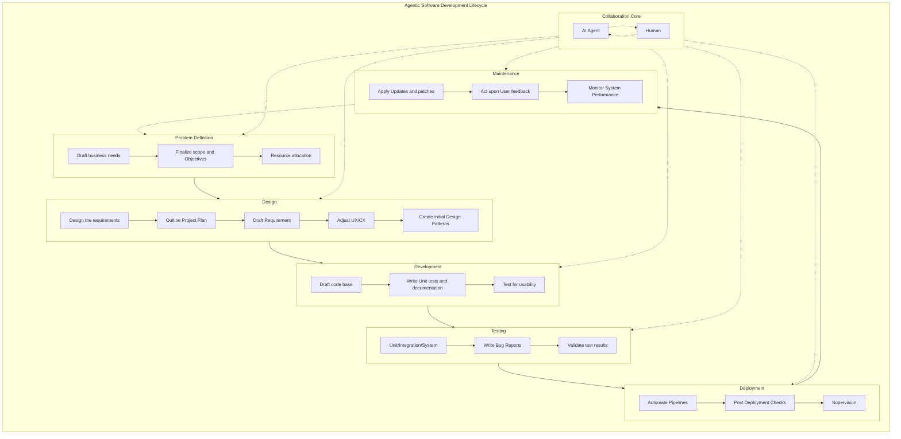
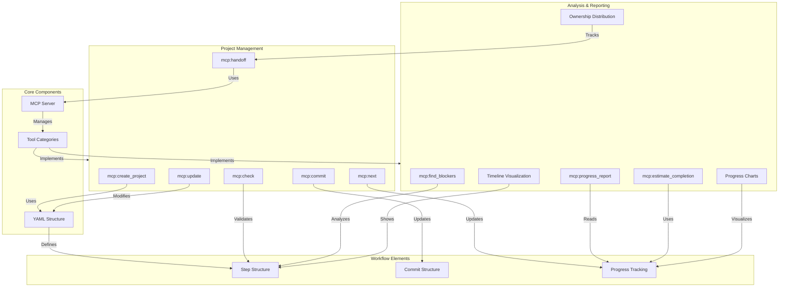
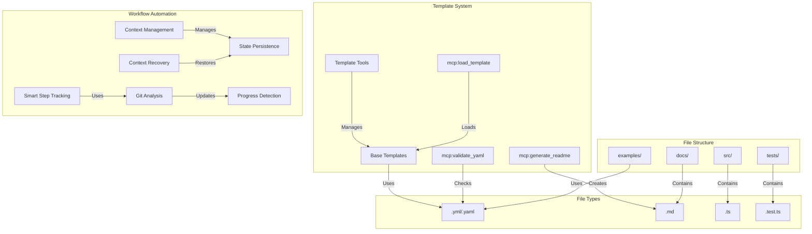
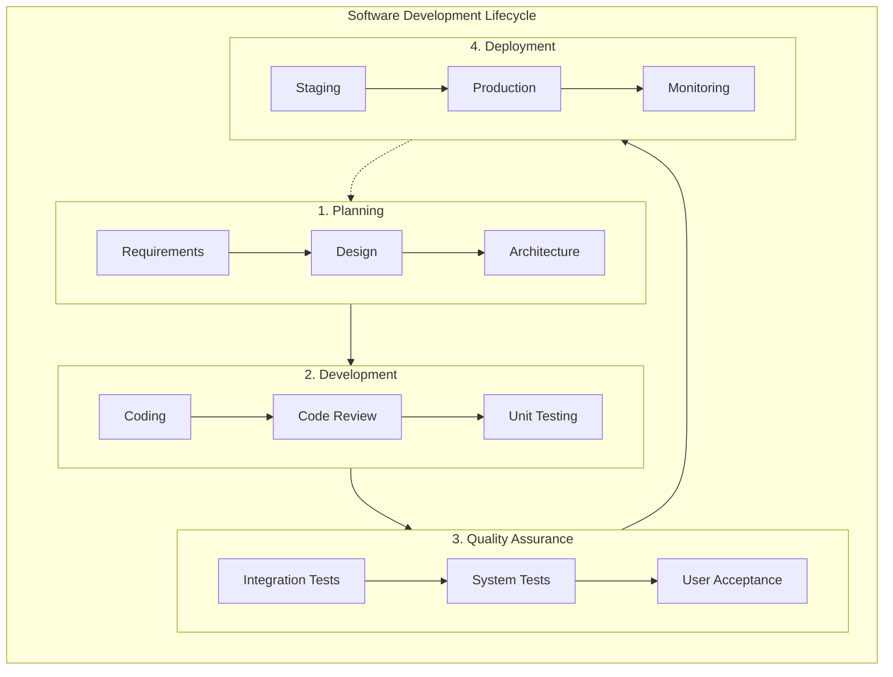

# Agentic Software Development Lifecycle (ASDLC)

## Architecture



## Overview

The Agentic Software Development Lifecycle (ASDLC) is an evolution of traditional SDLC that places AI Agent and Human collaboration at the center of every phase. This approach ensures that artificial intelligence capabilities are seamlessly integrated throughout the development process while maintaining human oversight and decision-making authority.

## Key Principles

### 1. Collaborative Core
- **AI Agent**: Provides automation, analysis, and implementation capabilities
- **Human**: Provides strategic direction, creative input, and quality oversight
- **Continuous Interaction**: Both AI and human collaborate throughout all phases

### 2. Phase Integration
Each phase benefits from AI-Human collaboration:
- **Problem Definition**: AI assists in analysis while humans provide business context
- **Design**: AI generates options while humans make strategic decisions
- **Development**: AI handles routine coding while humans review and guide
- **Testing**: AI automates testing while humans validate outcomes
- **Deployment**: AI manages pipelines while humans supervise critical decisions
- **Maintenance**: AI monitors systems while humans handle user feedback

### 3. Continuous Feedback Loop
The circular nature ensures continuous improvement and adaptation based on:
- User feedback
- System performance
- Business needs evolution
- Technology advancements

## Human vs AI Responsibilities

### Human Responsibilities
- Strategic decision making
- Business requirement validation
- Creative problem solving
- Quality assurance oversight
- User experience design
- Risk assessment

### AI Agent Responsibilities
- Code generation and optimization
- Automated testing
- Performance monitoring
- Documentation generation
- Pattern recognition
- Routine task automation

### Shared Responsibilities
- Code review
- Design validation
- Problem analysis
- Progress tracking
- Quality control
- Knowledge management

## Integration with AWP

The Agentic SDLC works in conjunction with the Agentic Workflow Protocol (AWP) to provide:
- Structured collaboration frameworks
- Context management across phases
- Progress tracking and handoff procedures
- Documentation synchronization
- Quality gates and approval processes

# 🚀 MCP Agentic SDLC Project Plan

## 🎯 Project Overview
Building a comprehensive suite of tools and templates to support the MCP Agentic SDLC framework - a transparent, collaborative Software Development Life Cycle management standard for human-AI teams.

## 📚 Section Definitions

### Core MCP Tool Suite Development
> The fundamental tools that form the backbone of the SDLC framework. These tools handle the basic operations and management of the development lifecycle, ensuring consistent project structure and workflow.

### Template System
> Pre-built, customizable templates and tools for different project types. This system helps teams quickly bootstrap new projects while maintaining SDLC standards and best practices.

### Workflow Automation
> Tools and processes that automate routine tasks, track progress, and maintain context throughout the development lifecycle. This ensures smooth transitions between steps and team members (both human and AI).

### Analysis & Reporting
> Components that provide insights into project progress, identify potential issues, and help teams make informed decisions. These tools help maintain project transparency and accountability.

### Documentation & Examples
> Comprehensive guides, real-world examples, and best practices that help teams understand and effectively implement the SDLC methodology in their projects.

## 🔍 Key Elements & Components

### Command Prefixes
- `mcp:` - Model Context Protocol commands for core functionality
- `init_` - Initialization and setup commands
- `check_` - Verification and status check commands

### File Types
- `.yml/.yaml` - Configuration files that define project structure and workflow
- `.md` - Documentation files (README, guides, etc.)
- `.ts` - TypeScript source files for tool implementation
- `.test.ts` - Test files for verifying functionality

### Core Components
> **MCP Server**
- Main server implementation that handles tool registration and execution
- Manages communication between tools and clients
- Handles context preservation and recovery

> **YAML Structure**
- `init:` - Onboarding instructions and initial setup
- `goal:` - Project objectives and success criteria
- `steps:` - Hierarchical task breakdown with status
- `procedures:` - Workflow definitions and processes
- `collaboration:` - Human-AI interaction rules

> **Tool Categories**
- **Management Tools**: Handle project lifecycle (`create`, `update`, `commit`)
- **Progress Tools**: Track and report status (`check`, `report`, `analyze`)
- **Context Tools**: Manage state and memory (`recover`, `checkpoint`, `persist`)
- **Template Tools**: Handle project scaffolding (`load`, `validate`, `generate`)

### Directory Structure Elements
> **Source Directories**
- `src/tools/` - Individual tool implementations
- `src/templates/` - Project templates and scaffolds
- `src/utils/` - Shared utility functions
- `src/types/` - TypeScript type definitions

> **Support Directories**
- `examples/` - Example projects and use cases
- `docs/` - Documentation and guides
- `tests/` - Test suites and test utilities

### Workflow Elements
> **Step Structure**
```yaml
steps:
  - number: "1.0"    # Hierarchical step number
    name: "Step"     # Brief, descriptive name
    description: ""  # Detailed explanation
    owner: ""        # Human or AI ownership
    done: false      # Completion status
    requires_human: false  # Human approval flag
```

> **Commit Structure**
```yaml
type(scope step): subject
# Example: feat(cli 2.1): add greeting logic
```

> **Progress Tracking**
- Current Phase: Active major version number
- Active Step: Current task being worked on
- Completed: Last finished step
- Next: Upcoming task

### Tool Naming Convention
> **Format**: `category:action`
```
mcp:create_project  # Creates new project
mcp:update         # Updates documentation
mcp:commit         # Handles git commits
mcp:next           # Moves to next step
mcp:check          # Verifies status
mcp:handoff        # Transfers ownership
```

## 📋 Project Goals & Steps

### 1.0 Core MCP Tool Suite Development
> This phase focuses on building and enhancing the fundamental tools that power the SDLC framework. The goal is to create a robust foundation of command-line tools that manage project lifecycle, structure, and workflow automation.

- [ ] 1.1 Expand current `init_sdlc` functionality
  > Enhances the initial setup tool to support various project types and configurations, making project bootstrapping more flexible and powerful.
  - [x] 1.1.1 Basic folder structure creation
  - [ ] 1.1.2 Add template selection option
  - [ ] 1.1.3 Add configuration options

- [ ] 1.2 Project Management Tools
  > A suite of tools that handle day-to-day project management tasks, ensuring consistent workflow and documentation across the team.
  
  - [ ] 1.2.1 `mcp:create_project` - New project initialization
    > Creates a new project with proper SDLC structure
    - Uses **YAML Structure** (`init`, `goal`, `steps`)
    - Creates initial **Directory Structure** (`src/`, `docs/`, `tests/`)
    - Implements **Step Structure** template
    - Related to: Tool Categories > Management Tools
  
  - [ ] 1.2.2 `mcp:update` - Sync README and YAML
    > Keeps documentation and project state in sync
    - Updates **Progress Tracking** elements
    - Modifies `.md` and `.yml` files (see **File Types**)
    - Uses **Core Components** > YAML Structure
    - Related to: Tool Categories > Progress Tools
  
  - [ ] 1.2.3 `mcp:commit` - Standardized commit handling
    > Ensures consistent git commit messages and step tracking
    - Follows **Commit Structure** format
    - Updates step status in YAML
    - Integrates with **Workflow Elements**
    - Related to: Tool Categories > Management Tools
  
  - [ ] 1.2.4 `mcp:next` - Step progression
    > Manages transition between project steps
    - Uses **Step Structure** for validation
    - Updates **Progress Tracking**
    - Handles **Workflow Elements** transitions
    - Related to: Tool Categories > Progress Tools
  
  - [ ] 1.2.5 `mcp:check` - Status verification
    > Verifies project state and step completion
    - Validates **YAML Structure**
    - Checks **Progress Tracking** elements
    - Cross-references git history
    - Related to: Tool Categories > Progress Tools
  
  - [ ] 1.2.6 `mcp:handoff` - Ownership transfer
    > Manages human-AI task transitions
    - Updates `owner` in **Step Structure**
    - Handles context preservation
    - Uses **Core Components** > MCP Server
    - Related to: Tool Categories > Context Tools

### 2.0 Template System
> A collection of pre-built templates and tools that accelerate project setup while ensuring adherence to best practices and standards.

- [ ] 2.1 Base Templates
  > Ready-to-use project templates for common application types, each pre-configured with SDLC best practices.
  
  - [ ] 2.1.1 Web Application template
    > Complete web application setup with SDLC integration
    - Uses **YAML Structure** for configuration
    - Implements **Directory Structure** patterns
    - Includes sample **Workflow Elements**
    - Related to: Tool Categories > Template Tools
  
  - [ ] 2.1.2 CLI Tool template
    > Command-line tool template with SDLC best practices
    - Follows **Core Components** structure
    - Uses **File Types** (`.ts`, `.test.ts`)
    - Implements **Step Structure**
    - Related to: Tool Categories > Template Tools
  
  - [ ] 2.1.3 API Service template
    > RESTful API service template with SDLC integration
    - Includes **Progress Tracking** setup
    - Uses **Directory Structure** patterns
    - Implements **Workflow Elements**
    - Related to: Tool Categories > Template Tools
  
  - [ ] 2.1.4 Library template
    > Reusable library template with SDLC configuration
    - Uses **Core Components** structure
    - Implements **Step Structure**
    - Includes **File Types** setup
    - Related to: Tool Categories > Template Tools

- [ ] 2.2 Template Tools
  > Utilities for managing and customizing templates, ensuring they remain maintainable and adaptable.
  
  - [ ] 2.2.1 `mcp:load_template` - Template loader
    > Loads and customizes project templates
    - Uses **YAML Structure** for configuration
    - Handles **Directory Structure** creation
    - Implements **File Types** setup
    - Related to: Tool Categories > Template Tools
  
  - [ ] 2.2.2 `mcp:validate_yaml` - Structure validator
    > Validates YAML configuration and structure
    - Checks **YAML Structure** compliance
    - Validates **Step Structure**
    - Verifies **Workflow Elements**
    - Related to: Tool Categories > Template Tools
  
  - [ ] 2.2.3 `mcp:generate_readme` - README generator
    > Generates comprehensive README documentation
    - Uses **YAML Structure** for content
    - Implements **Progress Tracking** sections
    - Creates **File Types** (`.md`)
    - Related to: Tool Categories > Template Tools

### 3.0 Workflow Automation
> Tools and systems that automate repetitive tasks and maintain project context, enabling seamless collaboration between human and AI team members.

- [ ] 3.1 Smart Step Tracking
  > Intelligent tracking of project progress through git analysis and automated status updates.
  
  - [ ] 3.1.1 Git commit analysis
    > Analyzes git history for progress tracking
    - Uses **Commit Structure** format
    - Updates **Progress Tracking**
    - Integrates with **Core Components**
    - Related to: Tool Categories > Progress Tools
  
  - [ ] 3.1.2 Progress detection
    > Automatically detects step completion
    - Monitors **Step Structure** changes
    - Updates **Progress Tracking**
    - Uses **Workflow Elements**
    - Related to: Tool Categories > Progress Tools
  
  - [ ] 3.1.3 Status updates
    > Maintains current project status
    - Updates **YAML Structure**
    - Modifies **Progress Tracking**
    - Uses **Core Components**
    - Related to: Tool Categories > Progress Tools

- [ ] 3.2 Context Management
  > Systems for maintaining and recovering project context, crucial for long-running projects and AI collaboration.
  
  - [ ] 3.2.1 Context recovery system
    > Helps restore project context after breaks
    - Uses **Core Components** > MCP Server
    - Reads **YAML Structure**
    - Analyzes **Progress Tracking**
    - Related to: Tool Categories > Context Tools
  
  - [ ] 3.2.2 Progress checkpointing
    > Creates recoverable progress points
    - Saves **Step Structure** state
    - Records **Progress Tracking**
    - Uses **Workflow Elements**
    - Related to: Tool Categories > Context Tools
  
  - [ ] 3.2.3 State persistence
    > Maintains persistent project state
    - Uses **Core Components** storage
    - Manages **YAML Structure**
    - Handles **File Types**
    - Related to: Tool Categories > Context Tools

### 4.0 Analysis & Reporting
> Tools for gaining insights into project progress, identifying bottlenecks, and making data-driven decisions. These tools analyze various project elements to provide actionable insights.

- [ ] 4.1 Analysis Tools
  > Utilities that analyze project data to provide actionable insights and progress metrics.
  
  - [ ] 4.1.1 `mcp:progress_report` - Progress tracking
    > Generates comprehensive progress reports
    - Analyzes **Step Structure** completion
    - Uses **Progress Tracking** data
    - Integrates with **Core Components** > YAML Structure
    - Outputs to `.md` format (see **File Types**)
    - Related to: Tool Categories > Progress Tools
  
  - [ ] 4.1.2 `mcp:find_blockers` - Blocker detection
    > Identifies potential bottlenecks and dependencies
    - Analyzes `requires_human` flags in **Step Structure**
    - Checks **Workflow Elements** dependencies
    - Cross-references with **Progress Tracking**
    - Related to: Tool Categories > Progress Tools
  
  - [ ] 4.1.3 `mcp:estimate_completion` - Timeline estimation
    > Predicts project completion timelines
    - Uses historical **Progress Tracking** data
    - Analyzes **Step Structure** complexity
    - Considers **Workflow Elements** patterns
    - Related to: Tool Categories > Progress Tools

- [ ] 4.2 Visualization
  > Tools for visualizing project progress and metrics in an intuitive way.
  
  - [ ] 4.2.1 Progress charts
    > Visual representation of project progress
    - Based on **Progress Tracking** data
    - Shows **Step Structure** completion
    - Visualizes **Workflow Elements** flow
    - Related to: Tool Categories > Progress Tools
  
  - [ ] 4.2.2 Timeline visualization
    > Project timeline and milestone tracking
    - Uses **Step Structure** hierarchy
    - Shows **Progress Tracking** over time
    - Highlights **Workflow Elements** transitions
    - Related to: Tool Categories > Progress Tools
  
  - [ ] 4.2.3 Ownership distribution
    > Analysis of human-AI task distribution
    - Based on **Step Structure** `owner` field
    - Tracks **Workflow Elements** handoffs
    - Uses **Core Components** > MCP Server data
    - Related to: Tool Categories > Context Tools

### 5.0 Documentation & Examples
> Comprehensive documentation and real-world examples that demonstrate the effective use of the SDLC framework.

- [ ] 5.1 Documentation
  > Detailed guides and documentation for all aspects of the framework.
  - [ ] 5.1.1 Tool documentation
  - [ ] 5.1.2 Template guides
  - [ ] 5.1.3 Best practices

- [ ] 5.2 Example Projects
  > Complete, working examples that showcase the framework in real-world scenarios.
  - [ ] 5.2.1 Web app example
  - [ ] 5.2.2 CLI tool example
  - [ ] 5.2.3 API service example

## 🗂️ Project Structure
```
mcp-agentic-sdlc/
├── src/
│   ├── tools/           # Individual MCP tools
│   │   ├── init.ts
│   │   ├── update.ts
│   │   ├── commit.ts
│   │   ├── next.ts
│   │   ├── check.ts
│   │   └── handoff.ts
│   ├── templates/       # YAML templates
│   │   ├── web-app.yml
│   │   ├── cli-tool.yml
│   │   ├── api-service.yml
│   │   └── library.yml
│   ├── utils/          # Shared utilities
│   │   ├── yaml-parser.ts
│   │   ├── git-utils.ts
│   │   └── file-utils.ts
│   └── index.ts        # Main MCP server
├── examples/           # Real project examples
├── docs/              # Documentation
└── tests/             # Test suite
```

## 📈 Progress Tracking
> Maintains the current state of development, highlighting active work and next steps. This section should be updated after each completed step.

- Current Phase: 1.0 Core MCP Tool Suite Development
- Active Step: 1.1 Expand current `init_sdlc` functionality
- Completed: 1.1.1 Basic folder structure creation
- Next: 1.1.2 Add template selection option

## 🤝 Contribution
> Guidelines for contributing to the project while maintaining SDLC standards and practices.

This project follows the MCP Agentic SDLC methodology. To contribute:
1. Check the numbered steps above for current progress
2. Each step should be completed sequentially unless marked for parallel development
3. Follow the commit standard: `type(scope step): subject`
4. Update this README after completing each step

## 📝 Notes
> Important reminders and guidelines for maintaining project consistency and quality.

- Mark steps as done using [x] in the checkboxes
- Keep the Progress Tracking section updated
- Reference step numbers in all commits
- Document any blockers or dependencies between steps

## 📝 Agentic Workflow Protocol (AWP)

The AWP is a core part of our SDLC framework that defines how humans and AI agents collaborate. Here's the structure:

### Key AWP Components

#### 1. Project Metadata
```yaml
init: |
  # Onboarding instructions
author: Your Name (Your Org)
goal: |
  # Project objective
overview:
  - "1. Phase One"
outcome: |
  # Success criteria
```

#### 2. Collaboration Settings
```yaml
collaboration:
  default_ai_agent: "claude"
  human_approver: "your.email@company.com"
  approval_timeout: "48h"
  auto_handoff: true
```

#### 3. Step Structure
```yaml
steps:
  - number: 1
    name: "Phase"
    steps:
      - number: 1.1
        description: "Task description"
        owner: "ai_agent|human"
        requires_human: false
        done: false
```

#### 4. Core Procedures
- **update**: Sync documentation and status
- **commit**: Standardized commit messages
- **next**: Progress to next step
- **check**: Status verification
- **handoff**: Transfer ownership

#### 5. Commit Standards
```yaml
commitStandard:
  format: "type(scope step): subject"
  types: [feat, fix, docs, test, chore]
  rules:
    - Reference the step in every commit
    - Use imperative mood
  examples:
    - "feat(api 3.1): add endpoint"
```

### AWP Benefits
1. **Clear Ownership**
   - Explicit task assignment between humans and AI
   - Defined approval gates
   - Automated handoffs

2. **Progress Tracking**
   - Hierarchical step organization
   - Status tracking per step
   - Clear success criteria

3. **Context Preservation**
   - Structured documentation
   - Standardized procedures
   - History tracking

4. **Quality Control**
   - Required human approvals
   - Standardized commits
   - Consistent workflow

### AWP Integration Points
The AWP connects with our tools in several ways:

1. **Template System**
   - Templates include AWP configuration
   - AWP validates against templates
   - Templates enforce AWP standards

2. **Project Management**
   - Tools read AWP for status
   - Updates reflect in AWP
   - Commits follow AWP standards

3. **Analysis & Reporting**
   - Progress tracked via AWP
   - Blockers identified in AWP
   - Metrics derived from AWP

4. **Workflow Automation**
   - Automated AWP updates
   - Context preserved in AWP
   - State managed via AWP

### Example AWP Configurations
We provide several example configurations in the `examples/` directory:
- `awp1.yml`: Basic project setup
- `awp2.yml`: Web application config
- `awp3.yml`: API service config
- `awp4.yml`: Library project config
- `awp5.yml`: CLI tool config

## 📊 Component Relationships

### Core System Relationships


### Template and Automation Relationships


# Software Development Lifecycle (SDLC)

## Architecture



## Overview

The Software Development Lifecycle (SDLC) component provides a structured approach to software development with AI assistance. It defines clear phases, deliverables, and quality gates while maintaining flexibility for agile development.
