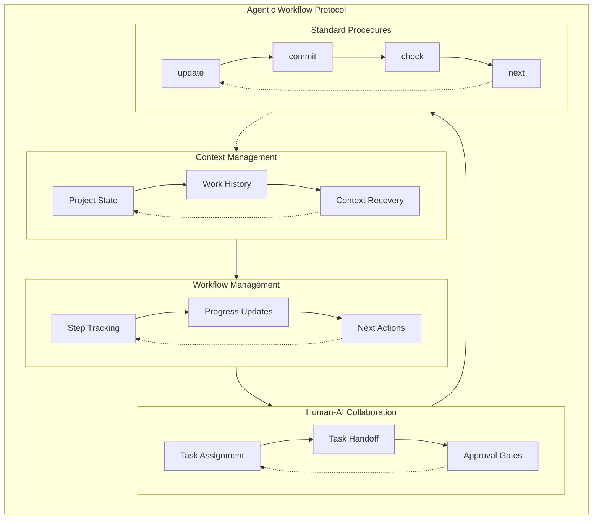

# Agentic Workflow Protocol (AWP)

## Overview

The Agentic Workflow Protocol (AWP) is a standardized approach for managing and documenting workflows between humans and AI agents. It provides a structured way to maintain project context, track progress, and ensure smooth collaboration between all participants.

## Architecture



## Workflow Example

Here's a practical example of how AWP works in a typical development task:

```mermaid
flowchart TD
    Start([Start: Feature Request]) --> Check1{{"check: Review current state"}}
    Check1 --> Step1["Step 2.1: Implement API endpoint"]
    
    Step1 --> Work1["AI: Generate code implementation"]
    Work1 --> Update1["update: Mark step 2.1 as done<br/>Update documentation"]
    Update1 --> Commit1["commit: feat(api 2.1): add user endpoint"]
    Commit1 --> Next1["next: Move to step 2.2"]
    
    Next1 --> Step2["Step 2.2: Add validation logic"]
    Step2 --> Handoff1["handoff: Transfer to human for review"]
    Handoff1 --> Review["Human: Review code quality"]
    
    Review --> Approve{Human Approval?}
    Approve -->|Yes| Work2["AI: Implement validation"]
    Approve -->|No| Feedback["Human: Provide feedback"]
    Feedback --> Work2
    
    Work2 --> Update2["update: Mark step 2.2 as done<br/>Update documentation"]
    Update2 --> Commit2["commit: feat(validation 2.2): add input validation"]
    Commit2 --> Next2["next: Move to step 2.3"]
    
    Next2 --> Step3["Step 2.3: Write tests"]
    Step3 --> Work3["AI: Generate unit tests"]
    Work3 --> Update3["update: Mark step 2.3 as done<br/>Update documentation"]
    Update3 --> Commit3["commit: test(api 2.3): add endpoint tests"]
    Commit3 --> Complete([Feature Complete])
    
    Complete --> Check2{{"check: Review next actionable step"}}
    Check2 --> NextFeature["Begin next feature..."]
    
    subgraph Legend["Process Legend"]
        AITask["AI Agent Task"]
        HumanTask["Human Task"]
        Procedure["AWP Procedure"]
        Decision{"Decision Point"}
    end
    
    classDef ai fill:#e1f5fe
    classDef human fill:#f3e5f5
    classDef procedure fill:#e8f5e8
    classDef decision fill:#fff3e0
    
    class Work1,Work2,Work3,AITask ai
    class Review,Feedback,HumanTask human
    class Update1,Update2,Update3,Commit1,Commit2,Commit3,Next1,Next2,Check1,Check2,Procedure procedure
    class Approve,Decision decision
```



## Core Concepts

### 1. Workflow Tracking
- Each step is clearly numbered and documented
- Progress is tracked through explicit status updates
- Context is maintained through structured documentation

### 2. Human-AI Collaboration
- Clear ownership of tasks (human vs AI)
- Explicit handoff procedures
- Built-in approval gates for critical decisions

### 3. Context Management
- Structured documentation to prevent context loss
- Clear recovery procedures after breaks or resets
- Synchronized state between code and documentation

## Protocol Structure

### Init Section
```yaml
init:
  - Read AWP.md and README.md
  - Follow defined procedures
  - Keep documentation in sync
  - Reference step numbers in commits
```

### Steps Format
```yaml
steps:
  - number: "1"
    name: "Step Name"
    description: "What needs to be done"
    owner: "human|ai_agent"
    requires_human: true|false
    done: true|false
```

### Core Procedures

1. **update**
   - Review and update documentation
   - Mark steps as complete
   - Ensure sync between code and docs

2. **commit**
   - Use standardized commit messages
   - Reference step numbers
   - Follow conventional commit format

3. **next**
   - Identify next actionable step
   - Check for blockers
   - Begin work on next task

4. **check**
   - Review current project state
   - Restore context if needed
   - Identify current actionable items

5. **handoff**
   - Package current context
   - Clear transfer of responsibility
   - Set expectations and timeouts

## commitStandard
@src/templates/commitStandard.yaml

## Best Practices

1. **Documentation**
   - Keep AWP.md and README.md in sync
   - Update documentation before marking steps complete
   - Include context for future reference

2. **Workflow**
   - Follow procedures consistently
   - Use step numbers in all references
   - Regular status updates

3. **Collaboration**
   - Clear task ownership
   - Explicit handoffs
   - Document decisions and rationale

## Integration with MCP Agentic SDLC

AWP is designed to work seamlessly with the MCP Agentic SDLC framework:
- AWP provides the workflow protocol
- SDLC provides the development lifecycle structure
- Together they create a complete system for agentic software development

## Example Implementation

See the `examples/` directory for practical implementations of AWP in different project contexts:
- `awp1.yml`: Simple CLI tool project
- `awp2.yml`: Web application project
- `awp3.yml`: API development project
- `awp4.yml`: Library development project
- `awp5.yml`: Full-stack application project 
