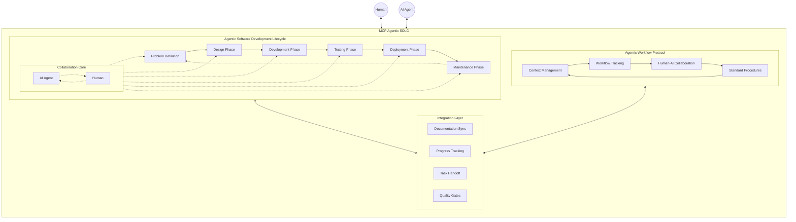

# MCP Agentic SDLC

A comprehensive framework for managing software development lifecycle with AI agents, combining structured development processes with intelligent workflow management.

## Overview

MCP Agentic SDLC consists of two main components:

1. **Agentic Software Development Lifecycle (ASDLC)** - [`ASDLC.md`](./ASDLC.md)
   - AI-Human collaborative development process
   - Structured development phases with agentic integration
   - Continuous feedback loops
   - Balanced responsibility distribution

2. **Agentic Workflow Protocol (AWP)** - [`AWP.md`](./AWP.md)
   - Human-AI collaboration workflow
   - Context management
   - Progress tracking
   - Standardized procedures

**New to MCP Agentic SDLC?** Start with [`workflow.md`](./docs/workflow.md) for a comprehensive explanation of the server architecture, workflow, and how all components work together.

## Architecture



## Getting Started

### Quick Start with MCP Tools

1. **Call the `base` tool** to start project setup:
   - Provide backlog name (e.g., "ecommerce", "crm")
   - Choose project type: **MVP**, **POC**, or **Full/Pro**
   - Answer type-specific questions (or say "I don't know" / "AI" for recommendations)

2. **Review AI recommendations** (if any):
   - AI generates recommendations for missing elements
   - Review and confirm or modify recommendations

3. **Call the `init` tool** to create project structure:
   - Creates `backlog-<name>/<type>/` directory
   - Generates populated `requirements.md`, `backlog.md`, `tech-specs.md`, and `base.md`
   - Sets up task structure with initial tasks

### Project Structure

After initialization, your project will have:

```
agentic-sdlc/
├── backlog-<name>/
│   └── <type>/          # mvp, poc, or pro
│       ├── base.md              # AWP Project Foundation Agreement
│       ├── requirements.md      # Project requirements
│       ├── backlog.md           # Project backlog
│       ├── tech-specs.md        # Technical specifications
│       └── tasks/
│           ├── planned/         # Active tasks
│           ├── unplanned/       # Unplanned tasks (U- prefix)
│           └── completed/      # Completed tasks
├── README.md
├── ASDLC.md
├── AWP.md
└── commitStandard.md
```

### Documentation

1. Read [`ASDLC.md`](./ASDLC.md) for the agentic development lifecycle framework
2. Read [`AWP.md`](./AWP.md) for the workflow protocol
3. Check the `src/recipes/` directory for methodology recipes

## Features

### MCP Tools

- **`base`** - Collects project requirements with intelligent question flow
  - Supports MVP, POC, and Full/Pro project types
  - Type-specific questions tailored to project approach
  - "I don't know" / "AI" support for missing elements

- **`recommend`** - Generates AI recommendations for missing project elements
  - Based on foundational information and best practices
  - Presents recommendations for user review before proceeding

- **`init`** - Creates complete project structure
  - Generates populated requirements, backlog, and tech specs
  - Creates `base.md` with all agreed-upon information
  - Sets up task structure following recipe methodologies

### Project Types

- **MVP (Minimum Viable Product)** - Production-ready, MVP-scoped features
- **POC (Proof of Concept)** - Proof-focused, concept validation
- **Full/Pro** - Complete project with all features

### Recipe System

Comprehensive recipes for each project type:
- `*-backlog-recipe.md` - Backlog creation methodology
- `*-requirements-recipe.md` - Requirements documentation
- `*-tech-specs-recipe.md` - Technical specifications

### Core Features

- Structured development process
- Clear human-AI collaboration guidelines
- Context preservation mechanisms
- Standardized commit messages
- Progress tracking
- Documentation synchronization
- Framework-agnostic (works with Scrum, Kanban, Waterfall, etc.)
- Topic-agnostic (applies to any project type)

## Documentation

- [`docs/workflow.md`](./docs/workflow.md) - **Start here!** Comprehensive guide to understanding the MCP server architecture, workflow, and how all components work together
- [`ASDLC.md`](./ASDLC.md) - Agentic Software Development Lifecycle documentation
- [`AWP.md`](./AWP.md) - Agentic Workflow Protocol documentation
- [`docs/mcp-config.md`](./docs/mcp-config.md) - Example MCP server configuration for Cursor and Claude Desktop
- `src/recipes/` - Methodology recipes for backlog, requirements, and tech specs
  - MVP recipes: `mvp-backlog-recipe.md`, `mvp-requirements-recipe.md`, `mvp-tech-specs-recipe.md`
  - POC recipes: `poc-backlog-recipe.md`, `poc-requirements-recipe.md`, `poc-tech-specs-recipe.md`
  - Pro recipes: `pro-backlog-recipe.md`, `pro-requirements-recipe.md`, `pro-tech-specs-recipe.md`

## Workflow

### Step 1: Project Setup (`base` tool)

1. Provide backlog name
2. Choose project type (MVP/POC/Pro)
3. Answer type-specific questions:
   - Foundational questions (required)
   - Derivable questions (can say "I don't know" or "AI")

### Step 2: Review Recommendations (if needed)

If you said "I don't know" or "AI" for any questions:
1. AI generates recommendations using `recommend` tool
2. Review recommendations
3. Accept, modify, or reject recommendations

### Step 3: Project Creation (`init` tool)

1. AI calls `init` with all confirmed information
2. Project structure created with populated files:
   - `base.md` - AWP Project Foundation Agreement (reference document)
   - `requirements.md` - Complete requirements
   - `backlog.md` - Project backlog
   - `tech-specs.md` - Technical specifications
   - `tasks/` - Task structure

### Step 4: Development

Follow the recipes and AWP protocol for ongoing development.

## Contributing

Contributions are welcome! Please read our contributing guidelines and code of conduct.

## License

This project is licensed under the MIT License - see the LICENSE file for details.

## Author

[Michael Wybraniec](https://michaelwybraniec.com) 