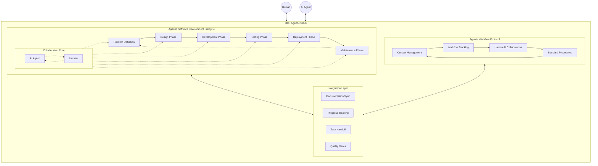

# MCP Agentic SDLC

A comprehensive framework for managing software development lifecycle with AI agents, combining structured development processes with intelligent workflow management.

## Overview

MCP Agentic SDLC consists of two main components:

1. **Agentic Software Development Lifecycle (ASDLC)** - [`ASDLC.md`](./ASDLC.md)
   - AI-Human collaborative development process
   - Structured development phases with agentic integration
   - Continuous feedback loops
   - Balanced responsibility distribution

2. **Agentic Workflow Protocol (AWP)** - [`AWP.md`](./AWP.md)
   - Human-AI collaboration workflow
   - Context management
   - Progress tracking
   - Standardized procedures

## Architecture

## Getting Started

1. Read [`ASDLC.md`](./ASDLC.md) for the agentic development lifecycle framework
2. Read [`AWP.md`](./AWP.md) for the workflow protocol
3. Check the `examples/` directory for practical implementations

## Features

- Structured development process
- Clear human-AI collaboration guidelines
- Context preservation mechanisms
- Standardized commit messages
- Progress tracking
- Documentation synchronization
- Example implementations

## Documentation

- [`ASDLC.md`](./ASDLC.md) - Agentic Software Development Lifecycle documentation
- [`AWP.md`](./AWP.md) - Agentic Workflow Protocol documentation
- `examples/` - Example implementations and use cases

## Contributing

Contributions are welcome! Please read our contributing guidelines and code of conduct.

## License

This project is licensed under the MIT License - see the LICENSE file for details.

## Author

[Michael Wybraniec](https://michaelwybraniec.com) 