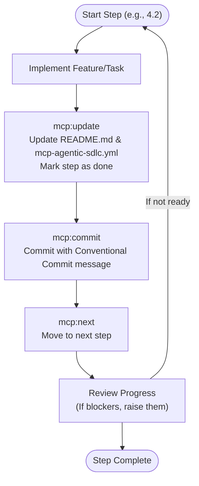
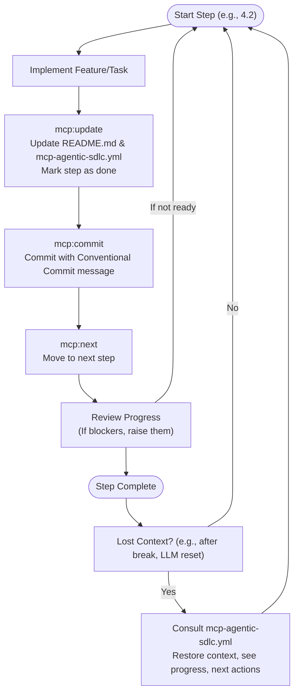

# 🚀 MCP Agentic SDLC

**MCP Agentic SDLC**

**Open Source Standard Candidate**

**Maintained by Community**, Author: [Michael Wybraniec](https://michaelwybraniec.com)

**Mission:** Empower teams and agents to build, track, and document projects with clarity, transparency, and flow through structured human-AI collaboration.

---

## 📚 Table of Contents
- [🚀 MCP Agentic SDLC](#-mcp-agentic-sdlc)
  - [📚 Table of Contents](#-table-of-contents)
  - [🌟 What is MCP Agentic SDLC?](#-what-is-mcp-agentic-sdlc)
  - [🏷️ Key Terms](#️-key-terms)
  - [🔄 MCP Agentic SDLC Examples](#-mcp-agentic-sdlc-examples)
  - [🧠 Handling Memory Loss or Returning to Work (Diagram)](#-handling-memory-loss-or-returning-to-work-diagram)
  - [🗂️ MCP Agentic SDLC File Structure Explained](#️-mcp-agentic-sdlc-file-structure-explained)
  - [🛠️ How to Use MCP Agentic SDLC in Your Project](#️-how-to-use-mcp-agentic-sdlc-in-your-project)
  - [📋 Best Practices](#-best-practices)
  - [📝 Example MCP Agentic SDLC YAML](#-example-mcp-agentic-sdlc-yaml)

---

## 🌟 What is MCP Agentic SDLC?

**MCP Agentic SDLC** is a transparent, agentic, and collaborative Software Development Lifecycle management standard. It is designed for both solo developers and teams (including AI agents), ensuring everyone stays in sync, code and docs are always aligned, and progress is transparent. MCP Agentic SDLC is both human- and machine-readable, making it ideal for hybrid human/AI workflows.

---

## 🏷️ Key Terms

**VIBE-CODING**
> A state of creative, uninterrupted coding flow, where you (and optionally your agent) are fully immersed in building, iterating, and shipping features. MCP Agentic SDLC helps you stay in this flow by keeping your roadmap and progress tracking frictionless and always up to date.

**OVER-VIBING**
> This is when you let your agent work for you too much, and then it forgets the context due to network or LLM limitations. It can lead to overlooking the context, and/or losing track of the project's progress, architecture, or complexity.

**MCP Agentic SDLC**
> MCP Agentic SDLC is designed to prevent over-vibing by making project strategy, progress, actions, and procedures always visible and reviewable for humans and agents through structured human-AI collaboration.

---

## 🔄 MCP Agentic SDLC Examples

Below is a visual representation of the standard MCP Agentic SDLC for each step:



---

## 🧠 Handling Memory Loss or Returning to Work (Diagram)

MCP Agentic SDLC helps you or your agent recover context after a break, LLM reset, or network issue. Here's how:



---

## 🗂️ MCP Agentic SDLC File Structure Explained

> **The `mcp-agentic-sdlc.yml` file is your project's living roadmap.**

| Section           | Purpose                                                      |
|-------------------|-------------------------------------------------------------|
| **init**          | Onboarding instructions for humans/agents                   |
| **author**        | Main author/maintainer                                      |
| **goal**          | Project's main objective                                    |
| **overview**      | High-level project phases                                   |
| **outcome**       | Intended final result                                       |
| **steps**         | Hierarchical, numerated checklist of all steps              |
| **procedures**    | Core workflow actions (update, commit, next, check, etc.)   |
| **notes**         | Reminders and project-wide policies                         |
| **commitStandard**| Commit message format, rules, and examples                  |
| **collaboration** | Human-AI task ownership and handoff rules                   |

**Section Details:**
- **init**: Step-by-step onboarding for new contributors or agents.
- **goal**: The north star for the project.
- **overview**: A list of the main phases or milestones.
- **outcome**: What success looks like.
- **steps**: A tree of all actionable steps, each with a number, name, description, done status, and ownership (human vs AI).
- **procedures**: Canonical definitions for `update`, `commit`, `next`, `check`, and `handoff` actions. These ensure everyone (and every agent) follows the same workflow for updating docs, committing, and progressing.
- **notes**: Project-wide reminders, policies, or tips.
- **commitStandard**: The required format for all commit messages, with types, rules, and examples.
- **collaboration**: Rules for human-AI task ownership, handoffs, and approval gates.

---

## 🛠️ How to Use MCP Agentic SDLC in Your Project

1. **Copy a template** (or start from scratch) and place it in your project root as `mcp-agentic-sdlc.yml`.
2. **Edit the header**: Add your name, organization, and contact info.
3. **Define your goal and outcome**: Clearly state what your project aims to achieve and what success looks like.
4. **Set up collaboration**: Define which tasks are for humans vs AI agents.
5. **List your main steps** in the `overview` and break them down in the `steps` section. Use nested steps for complex projects.
6. **Follow the procedures**:
   - **update**: After each step, review and update both `README.md` and `mcp-agentic-sdlc.yml` to reflect the current state and next actions. Mark steps as done.
   - **commit**: Commit your changes using the commit standard, referencing the relevant step.
   - **next**: Move to the next actionable step only after update and commit are complete. Check for blockers before proceeding.
   - **check**: Use this to find the next actionable step (first not done) and restore context after a break.
   - **handoff**: Transfer task ownership between human and AI when needed.
7. **Keep everything in sync**: The goal is to keep documentation, workflow, and codebase always aligned.

---

## 📋 Best Practices

- Always update both `mcp-agentic-sdlc.yml` and `README.md` after each step.
- Use the `procedures` section as your canonical workflow for update, commit, next, check, and handoff.
- Reference the step number in every commit message.
- Use the `commitStandard` for all commits to enable automation and traceability.
- Clearly define human vs AI task ownership to prevent confusion.
- Use handoff procedures when transferring work between human and AI.
- If you see blockers, critical points, or have suggestions, document and address them before moving on.
- Use the `init` section to onboard new contributors or agents.
- Review the `notes` section for project-wide policies.
- Set up approval gates for critical human decisions.

---

## 📝 Example MCP Agentic SDLC YAML

```yaml
# MCP Agentic SDLC for Project X
init: |
  - Read mcp-agentic-sdlc.yml and README.md to understand the workflow.
  - Follow the procedures for update, commit, next, check, and handoff.
  - Respect human-AI task ownership and approval gates.
  - Keep everything in sync.
author: Jane Dev
goal: |
  Build a simple CLI tool in Node.js that prints a greeting.
overview:
  - "1. Setup"
  - "2. Implement CLI logic"
  - "3. Test & Document"
outcome: |
  A working CLI tool that prints a greeting, with tests and documentation.
  
collaboration:
  default_ai_agent: "claude"
  human_approver: "jane.dev@company.com"
  auto_handoff: true

steps:
  - number: 1
    name: "Setup"
    steps:
      - number: 1.1
        description: "Initialize project with npm init -y"
        owner: "ai_agent"
        done: true
      - number: 1.2
        description: "Add index.js and package.json scripts"
        owner: "ai_agent"
        done: true
  - number: 2
    name: "Implement CLI logic"
    steps:
      - number: 2.1
        description: "Write greeting logic in index.js"
        owner: "ai_agent"
        done: false
      - number: 2.2
        description: "Review and approve CLI behavior"
        owner: "human"
        requires_human: true
        done: false
        
procedures:
  - key: update
    number: 1
    name: "update"
    description: |
      Review README.md and mcp-agentic-sdlc.yml after each step. Update as needed to reflect the current state and next actions.
  - key: commit
    number: 2
    name: "commit"
    description: |
      Use the commitStandard for all commit messages. Reference the step in every commit.
  - key: next
    number: 3
    name: "next"
    description: |
      After update and commit, proceed to the next main step.
  - key: handoff
    number: 4
    name: "handoff"
    description: |
      Transfer task ownership between human and AI with proper context.
      
notes:
  - "Reference the step in every commit."
  - "Respect human-AI collaboration boundaries."
  
commitStandard:
  format: "type(scope step): subject"
  types: [feat, fix, docs, test, chore]
  rules:
    - Reference the step in every commit.
    - Use imperative mood.
  examples:
    - "feat(cli 2.1): add greeting logic"
    - "docs(readme 3.2): add usage instructions"
```

---

**MCP Agentic SDLC is a living protocol. Help improve it by contributing feedback, templates, and best practices!**