<div align="center">


# 🚀 MCP Agentic SDLC

### **AGENTIC WORKFLOW PROTOCOL**
### *HUMAN-AI Precision Strike for Controlled Vibe Coding & Context Engineering*

[](https://github.com/michaelwybraniec/mcp-agentic-sdlc)
[](https://modelcontextprotocol.io)
[](LICENSE)
[](https://github.com/michaelwybraniec/mcp-agentic-sdlc)
[](https://github.com/michaelwybraniec/mcp-agentic-sdlc)

**Precision-engineered collaboration framework for controlled vibe coding and context preservation.**

*Community project: AI Engineering Barcelona | Author: [Michael Wybraniec](https://michaelwybraniec.com) | [ONE-FRONT.COM](https://one-front.com) | [OVERVIBING.COM](https://overvibing.com)*

</div>

---

## 📚 Table of Contents
- [🚀 MCP Agentic SDLC](#-mcp-agentic-sdlc)
    - [**AGENTIC WORKFLOW PROTOCOL**](#agentic-workflow-protocol)
    - [*HUMAN-AI Precision Strike for Controlled Vibe Coding \& Context Engineering*](#human-ai-precision-strike-for-controlled-vibe-coding--context-engineering)
  - [📚 Table of Contents](#-table-of-contents)
  - [⚡ Quick Start](#-quick-start)
  - [🌟 What is MCP Agentic SDLC?](#-what-is-mcp-agentic-sdlc)
    - [🎯 **Core Philosophy**](#-core-philosophy)
    - [✨ **Key Features**](#-key-features)
  - [🏷️ Key Concepts](#️-key-concepts)
    - [🎨 **VIBE-CODING**](#-vibe-coding)
    - [⚠️ **OVER-VIBING**](#️-over-vibing)
    - [🛡️ **MCP Agentic SDLC**](#️-mcp-agentic-sdlc)
  - [🔄 MCP Agentic SDLC Examples](#-mcp-agentic-sdlc-examples)
  - [🧠 Handling Memory Loss or Returning to Work (Diagram)](#-handling-memory-loss-or-returning-to-work-diagram)
  - [🗂️ MCP Agentic SDLC File Structure Explained](#️-mcp-agentic-sdlc-file-structure-explained)
  - [🛠️ How to Use MCP Agentic SDLC in Your Project](#️-how-to-use-mcp-agentic-sdlc-in-your-project)
    - [Option 1: Using the MCP Server (Recommended)](#option-1-using-the-mcp-server-recommended)
    - [Option 2: Manual Setup](#option-2-manual-setup)
  - [🔧 MCP Server Tools and Resources](#-mcp-server-tools-and-resources)
    - [*Professional-grade tools for seamless project initialization and management*](#professional-grade-tools-for-seamless-project-initialization-and-management)
    - [🛠️ **Available Tools**](#️-available-tools)
    - [📚 **Available Resources**](#-available-resources)
    - [🔄 **Recommended Workflow**](#-recommended-workflow)
  - [📋 Best Practices](#-best-practices)
    - [*Professional guidelines for optimal MCP Agentic SDLC implementation*](#professional-guidelines-for-optimal-mcp-agentic-sdlc-implementation)
    - [🚀 **MCP Server Usage**](#-mcp-server-usage)
    - [🎯 **General Practices**](#-general-practices)
    - [🛡️ **Quality Assurance**](#️-quality-assurance)
  - [🔧 MCP Configuration Examples](#-mcp-configuration-examples)
    - [*Professional MCP Server Configuration for Cursor + Claude*](#professional-mcp-server-configuration-for-cursor--claude)
    - [**Cursor Configuration**](#cursor-configuration)
    - [**Claude Desktop Configuration**](#claude-desktop-configuration)
    - [**Advanced Configuration**](#advanced-configuration)
    - [**Quick Setup Steps**](#quick-setup-steps)
  - [📝 Example MCP Agentic SDLC YAML](#-example-mcp-agentic-sdlc-yaml)
  - [🤝 Contributing](#-contributing)
    - [🌟 **Star this repository if you find it helpful!**](#-star-this-repository-if-you-find-it-helpful)

---

## ⚡ Quick Start

<div align="center">

### *Get up and running in 3 simple steps*

</div>

1. **🎯 Collect Requirements**
   ```
   Use the 'base' tool to gather your project information
   ```

2. **🚀 Initialize Project**
   ```
   Use the 'init' tool to create your complete project structure
   ```

3. **📋 Follow AWP Procedures**
   ```
   Use the generated AWP.md for ongoing project management
   ```

<div align="center">

**Ready to revolutionize your development workflow?** [Jump to Configuration](#-mcp-configuration-examples)

</div>

---

## 🌟 What is MCP Agentic SDLC?

<div align="center">

> **A revolutionary approach to software development that bridges human creativity with AI efficiency**

</div>

**MCP Agentic SDLC** is a transparent, agentic, and collaborative Software Development Lifecycle management standard designed for the future of development. It seamlessly integrates human expertise with AI capabilities, ensuring:

- 🔄 **Perfect Synchronization** - Everyone stays in sync, code and docs are always aligned
- 📊 **Complete Transparency** - Progress is visible and trackable at all times  
- 🤖 **AI-Native Design** - Built for hybrid human/AI workflows from the ground up
- 📖 **Human & Machine Readable** - Works perfectly for both humans and AI agents
- 🚀 **Scalable Collaboration** - From solo developers to large distributed teams

### 🎯 **Core Philosophy**

*"HUMAN-AI Precision Strike for Controlled Vibe Coding & Context Engineering"*

### ✨ **Key Features**

<div align="center">

| 🚀 Feature | 📝 Description | 🎯 Benefit |
|------------|----------------|------------|
| **🎯 Precision Strike** | Targeted, controlled AI collaboration | Eliminates over-vibing and context loss |
| **📊 Complete Transparency** | All progress and decisions are visible | Maintains project clarity and accountability |
| **🔄 Seamless Integration** | Works with Cursor, Claude, and other MCP clients | Fits into existing workflows |
| **📋 Structured Backlog** | Dynamic task generation based on project requirements | Ensures comprehensive project planning |
| **🤖 AI-Native Design** | Built specifically for human-AI collaboration | Optimized for the future of development |
| **⚡ Quick Setup** | 3-step initialization process | Get started in minutes, not hours |

</div>

---

## 🏷️ Key Concepts

<div align="center">

| Concept | Definition | Impact |
|---------|------------|---------|
| **🎨 VIBE-CODING** | Creative, uninterrupted coding flow with full immersion in building and shipping | **Positive** - Peak productivity state |
| **⚠️ OVER-VIBING** | Excessive AI delegation leading to context loss and project drift | **Negative** - Risk to project success |
| **🛡️ MCP Agentic SDLC** | Structured framework preventing over-vibing through transparency | **Solution** - Balanced human-AI collaboration |

</div>

### 🎨 **VIBE-CODING**
> A state of creative, uninterrupted coding flow where you (and optionally your AI agent) are fully immersed in building, iterating, and shipping features. MCP Agentic SDLC helps you maintain this flow by keeping your roadmap and progress tracking frictionless and always up to date.

### ⚠️ **OVER-VIBING** 
> When you delegate too much to your AI agent, leading to context loss due to network or LLM limitations. This can result in overlooking project context, losing track of progress, architecture, or complexity.

### 🛡️ **MCP Agentic SDLC**
> Our solution designed to prevent over-vibing by making project strategy, progress, actions, and procedures always visible and reviewable for both humans and AI agents through structured collaboration.

---

## 🔄 MCP Agentic SDLC Examples

Below is a visual representation of the standard MCP Agentic SDLC for each step:


---

## 🧠 Handling Memory Loss or Returning to Work (Diagram)

MCP Agentic SDLC helps you or your agent recover context after a break, LLM reset, or network issue. Here's how:


---

## 🗂️ MCP Agentic SDLC File Structure Explained

> **The `mcp-agentic-sdlc.yml` file is your project's living roadmap.**

| Section           | Purpose                                                      |
|-------------------|-------------------------------------------------------------|
| **init**          | Onboarding instructions for humans/agents                   |
| **author**        | Main author/maintainer                                      |
| **goal**          | Project's main objective                                    |
| **overview**      | High-level project phases                                   |
| **outcome**       | Intended final result                                       |
| **steps**         | Hierarchical, numerated checklist of all steps              |
| **procedures**    | Core workflow actions (update, commit, next, check, etc.)   |
| **notes**         | Reminders and project-wide policies                         |
| **commitStandard**| Commit message format, rules, and examples                  |
| **collaboration** | Human-AI task ownership and handoff rules                   |

**Section Details:**
- **init**: Step-by-step onboarding for new contributors or agents.
- **goal**: The north star for the project.
- **overview**: A list of the main phases or milestones.
- **outcome**: What success looks like.
- **steps**: A tree of all actionable steps, each with a number, name, description, done status, and ownership (human vs AI).
- **procedures**: Canonical definitions for `update`, `commit`, `next`, `check`, and `handoff` actions. These ensure everyone (and every agent) follows the same workflow for updating docs, committing, and progressing.
- **notes**: Project-wide reminders, policies, or tips.
- **commitStandard**: The required format for all commit messages, with types, rules, and examples.
- **collaboration**: Rules for human-AI task ownership, handoffs, and approval gates.

---

## 🛠️ How to Use MCP Agentic SDLC in Your Project

### Option 1: Using the MCP Server (Recommended)

1. **Install the MCP Agentic SDLC server** in your development environment
2. **Use the `base` tool** to collect your project requirements:
   - Project goals and objectives
   - Development phases and milestones  
   - Technology stack and tools
   - Success criteria and outcomes
3. **Use the `init` tool** to create your complete project structure:
   - Creates `agentic-sdlc/` directory in your project
   - Generates `AWP.md` with your project details
   - Creates project backlog using the backlog recipe methodology
   - Sets up task structure with planned/unplanned/completed directories
4. **Use the `get_backlog_recipe` tool** to access the complete backlog creation methodology
5. **Follow the AWP procedures** in your generated `AWP.md` file

### Option 2: Manual Setup

1. **Copy a template** (or start from scratch) and place it in your project root as `mcp-agentic-sdlc.yml`.
2. **Edit the header**: Add your name, organization, and contact info.
3. **Define your goal and outcome**: Clearly state what your project aims to achieve and what success looks like.
4. **Set up collaboration**: Define which tasks are for humans vs AI agents.
5. **List your main steps** in the `overview` and break them down in the `steps` section. Use nested steps for complex projects.
6. **Follow the procedures**:
   - **update**: After each step, review and update both `README.md` and `mcp-agentic-sdlc.yml` to reflect the current state and next actions. Mark steps as done.
   - **commit**: Commit your changes using the commit standard, referencing the relevant step.
   - **next**: Move to the next actionable step only after update and commit are complete. Check for blockers before proceeding.
   - **check**: Use this to find the next actionable step (first not done) and restore context after a break.
   - **handoff**: Transfer task ownership between human and AI when needed.
7. **Keep everything in sync**: The goal is to keep documentation, workflow, and codebase always aligned.

---

## 🔧 MCP Server Tools and Resources

<div align="center">

### *Professional-grade tools for seamless project initialization and management*

</div>

### 🛠️ **Available Tools**

<div align="center">

| 🎯 Tool | 📝 Description | 🚀 Usage |
|---------|----------------|----------|
| **`base`** | Collects comprehensive project requirements | **Step 1:** Use first to gather all project information |
| **`init`** | Creates complete project structure with backlog | **Step 2:** Use after `base` to set up your project |
| **`get_backlog_recipe`** | Provides backlog creation methodology | **Reference:** Use to understand backlog creation principles |

</div>

### 📚 **Available Resources**

<div align="center">

| 🌐 Resource | 🔗 URI | 📖 Description |
|-------------|--------|----------------|
| **Backlog Recipe** | `recipe://backlog-recipe` | Complete methodology for creating project backlogs using the Agentic SDLC approach |

</div>

### 🔄 **Recommended Workflow**

```mermaid
graph LR
    A[🎯 base] --> B[🚀 init] --> C[📚 recipe] --> D[📋 AWP]
    A --> |"Collect Requirements"| A1[Goals, Phases, Tech, Success]
    B --> |"Create Structure"| B1[Project Files, Backlog, Tasks]
    C --> |"Get Guidance"| C1[Backlog Methodology]
    D --> |"Follow Procedures"| D1[Update, Commit, Next, Check]
```

<div align="center">



</div>

1. **🎯 Start with `base`** - Collect your project requirements comprehensively
2. **🚀 Use `init`** - Create your complete project structure with backlog
3. **📚 Access `recipe://backlog-recipe`** - Get professional guidance for backlog creation
4. **📋 Follow AWP procedures** - Use the generated `AWP.md` for ongoing project management

---

## 📋 Best Practices

<div align="center">

### *Professional guidelines for optimal MCP Agentic SDLC implementation*

</div>

### 🚀 **MCP Server Usage**

<div align="center">

| ✅ Do | ❌ Don't |
|--------|----------|
| Use `base` tool first to collect all requirements | Skip requirement collection |
| Specify `appDir` parameter for correct project location | Assume default directory |
| Access `recipe://backlog-recipe` for task creation guidance | Create tasks without methodology |
| Follow generated `AWP.md` procedures | Ignore established procedures |

</div>

### 🎯 **General Practices**

<div align="center">

| 📋 Practice | 🎯 Purpose | 🔧 Implementation |
|-------------|------------|-------------------|
| **Update Documentation** | Keep everything in sync | Update `AWP.md` and `README.md` after each step |
| **Follow Procedures** | Maintain consistency | Use procedures section as canonical workflow |
| **Reference Steps** | Enable traceability | Include step number in every commit message |
| **Use Commit Standards** | Enable automation | Follow `commitStandard` for all commits |
| **Define Ownership** | Prevent confusion | Clearly define human vs AI task ownership |
| **Document Blockers** | Maintain transparency | Document and address blockers before proceeding |

</div>

### 🛡️ **Quality Assurance**

- ✅ **Always update** both `AWP.md` and `README.md` after each step
- ✅ **Use procedures** section as your canonical workflow for update, commit, next, check, and handoff
- ✅ **Reference step numbers** in every commit message for traceability
- ✅ **Follow commit standards** for all commits to enable automation
- ✅ **Define clear ownership** between human and AI to prevent confusion
- ✅ **Use handoff procedures** when transferring work between human and AI
- ✅ **Document blockers** and address them before moving on
- ✅ **Set up approval gates** for critical human decisions

---

## 🔧 MCP Configuration Examples

<div align="center">

### *Professional MCP Server Configuration for Cursor + Claude*

</div>

### **Cursor Configuration**

**Location:** `~/.cursor/mcp_config.json`

```json
{
  "mcp": {
    "servers": {
      "agentic-sdlc": {
        "command": "node",
        "args": ["/Users/your-username/Documents/GitHub/mcp-agentic-sdlc/dist/index.js"],
        "env": {
          "NODE_ENV": "production"
        }
      }
    }
  }
}
```

### **Claude Desktop Configuration**

**macOS:** `~/Library/Application Support/Claude/claude_desktop_config.json`

```json
{
  "mcpServers": {
    "agentic-sdlc": {
      "command": "node",
      "args": ["/Users/your-username/Documents/GitHub/mcp-agentic-sdlc/dist/index.js"],
      "env": {
        "NODE_ENV": "production"
      }
    }
  }
}
```

**Windows:** `%APPDATA%\Claude\claude_desktop_config.json`

```json
{
  "mcpServers": {
    "agentic-sdlc": {
      "command": "node",
      "args": ["C:\\Users\\YourUsername\\Documents\\GitHub\\mcp-agentic-sdlc\\dist\\index.js"],
      "env": {
        "NODE_ENV": "production"
      }
    }
  }
}
```

**Linux:** `~/.config/claude/claude_desktop_config.json`

```json
{
  "mcpServers": {
    "agentic-sdlc": {
      "command": "node",
      "args": ["/home/your-username/Documents/GitHub/mcp-agentic-sdlc/dist/index.js"],
      "env": {
        "NODE_ENV": "production"
      }
    }
  }
}
```

### **Advanced Configuration**

```json
{
  "mcp": {
    "servers": {
      "agentic-sdlc": {
        "command": "node",
        "args": ["/path/to/mcp-agentic-sdlc/dist/index.js"],
        "env": {
          "NODE_ENV": "production",
          "LOG_LEVEL": "info"
        },
        "timeout": 30000,
        "retries": 3
      }
    }
  }
}
```

### **Quick Setup Steps**

1. **Install the MCP Server:**
   ```bash
   git clone https://github.com/michaelwybraniec/mcp-agentic-sdlc.git
   cd mcp-agentic-sdlc
   npm install
   npm run build
   ```

2. **Configure Cursor/Claude** with the appropriate JSON above

3. **Restart Cursor/Claude** to load the MCP server

4. **Test the connection** by using the `base` tool

---

## 📝 Example MCP Agentic SDLC YAML

```yaml
# MCP Agentic SDLC for Project X
init: |
  - Read mcp-agentic-sdlc.yml and README.md to understand the workflow.
  - Follow the procedures for update, commit, next, check, and handoff.
  - Respect human-AI task ownership and approval gates.
  - Keep everything in sync.
author: Jane Dev
goal: |
  Build a simple CLI tool in Node.js that prints a greeting.
overview:
  - "1. Setup"
  - "2. Implement CLI logic"
  - "3. Test & Document"
outcome: |
  A working CLI tool that prints a greeting, with tests and documentation.
  
collaboration:
  default_ai_agent: "claude"
  human_approver: "jane.dev@company.com"
  auto_handoff: true

steps:
  - number: 1
    name: "Setup"
    steps:
      - number: 1.1
        description: "Initialize project with npm init -y"
        owner: "ai_agent"
        done: true
      - number: 1.2
        description: "Add index.js and package.json scripts"
        owner: "ai_agent"
        done: true
  - number: 2
    name: "Implement CLI logic"
    steps:
      - number: 2.1
        description: "Write greeting logic in index.js"
        owner: "ai_agent"
        done: false
      - number: 2.2
        description: "Review and approve CLI behavior"
        owner: "human"
        requires_human: true
        done: false
        
procedures:
  - key: update
    number: 1
    name: "update"
    description: |
      Review README.md and mcp-agentic-sdlc.yml after each step. Update as needed to reflect the current state and next actions.
  - key: commit
    number: 2
    name: "commit"
    description: |
      Use the commitStandard for all commit messages. Reference the step in every commit.
  - key: next
    number: 3
    name: "next"
    description: |
      After update and commit, proceed to the next main step.
  - key: handoff
    number: 4
    name: "handoff"
    description: |
      Transfer task ownership between human and AI with proper context.
      
notes:
  - "Reference the step in every commit."
  - "Respect human-AI collaboration boundaries."
  
commitStandard:
  format: "type(scope step): subject"
  types: [feat, fix, docs, test, chore]
  rules:
    - Reference the step in every commit.
    - Use imperative mood.
  examples:
    - "feat(cli 2.1): add greeting logic"
    - "docs(readme 3.2): add usage instructions"
```

---

<div align="center">

## 🤝 Contributing

**MCP Agentic SDLC is a living protocol. Help improve it by contributing feedback, templates, and best practices!**

[](https://github.com/michaelwybraniec/mcp-agentic-sdlc)
[](https://github.com/michaelwybraniec/mcp-agentic-sdlc/issues)
[](https://github.com/michaelwybraniec/mcp-agentic-sdlc/discussions)

---

### 🌟 **Star this repository if you find it helpful!**

**Community Maintenance:** AI Engineering Barcelona  
**Built with ❤️ by [Michael Wybraniec](https://michaelwybraniec.com)**

*[ONE-FRONT.COM](https://one-front.com) | [OVERVIBING.COM](https://overvibing.com)*

---

<div align="center">

**🎯 Ready to transform your development workflow?**

[](https://github.com/michaelwybraniec/mcp-agentic-sdlc#-quick-start)
[](https://github.com/michaelwybraniec/mcp-agentic-sdlc#-what-is-mcp-agentic-sdlc)
[](https://github.com/michaelwybraniec/mcp-agentic-sdlc/discussions)

</div>

</div>